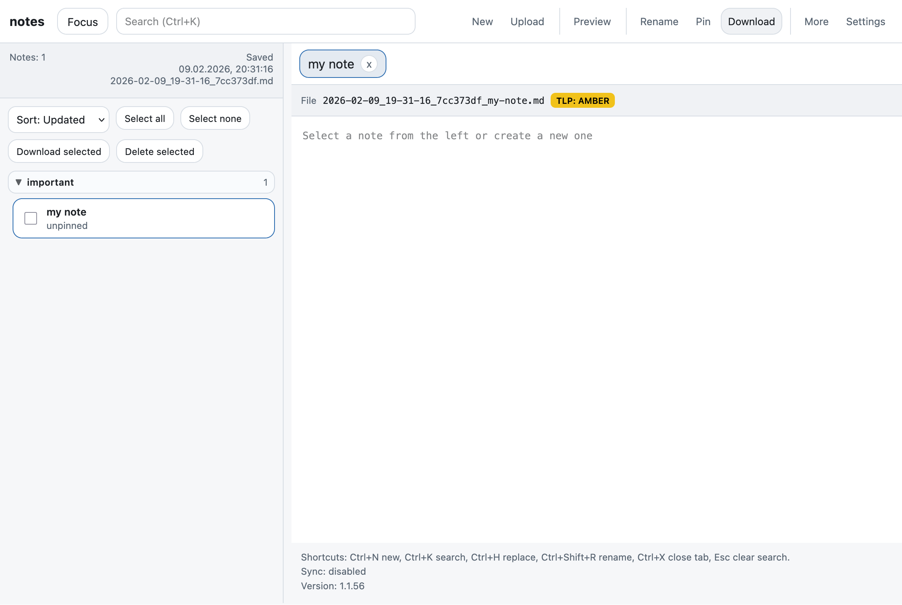
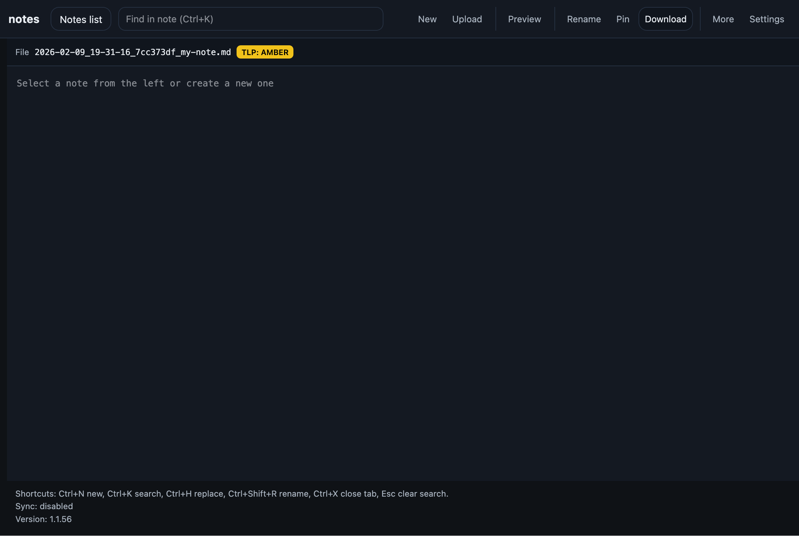

# stickynotes

Simple self-hosted sticky notes / scratchpad web app.

- Single user, no authentication
- File-based storage (no database)
- Autosave-first, keyboard-driven
- LAN/VPN only
- Dark / light theme (Nordic style)

## Screenshots





## Features

- **Tabs** – open multiple notes, switch with click or keyboard
- **Sidebar** – notes list grouped by subject, sortable, searchable
- **Autosave** – saves on every keystroke (debounced), no save button
- **Markdown preview** – toggle preview with format selection (Markdown, Text, JSON, YAML)
- **Search** – full-text search across filenames and content (Ctrl+K)
- **Search & Replace** – in-note find/replace with match highlighting
- **Table of Contents** – TOC panel with selectable heading depth
- **Daily Journal** – Logseq-inspired daily journal with collapsible year/month/day tree, aggregated views, and Ctrl+J shortcut
- **Subjects** – group notes by subject; autocomplete from existing subjects
- **Pin** – pin important notes to the top
- **PDF export** – Markdown-rendered PDF with metadata headers, TLP classification footer
- **Import** – upload `.md` / `.txt` files as notes
- **Export** – download individual notes or all notes as ZIP
- **Deep links** – share links via `/?id=<note_id>`
- **WebDAV sync** – sync notes to Nextcloud or any WebDAV server via rclone sidecar (push, pull, or two-way)

## Keyboard shortcuts

| Shortcut | Action |
|---|---|
| Ctrl+N | New note |
| Ctrl+J | Open today's journal |
| Ctrl+K | Search / find in note |
| Ctrl+H | Search & Replace |
| Ctrl+Shift+R | Rename |
| Ctrl+X | Close current tab |
| Esc | Clear search / close dialogs |

## Host setup

1) Bootstrap runtime folders:

```bash
sudo ./scripts/bootstrap.sh
```

2) Create `/opt/stickynotes/config/compose.env` (optional; defaults are fine):

```env
BIND_ADDR=0.0.0.0
HOST_PORT=8060
```

3) Deploy:

```bash
sudo ./scripts/deploy.sh <zip-or-directory> [version]
```

Open:

- UI: `http://<host-ip>:8060/`
- Health: `http://<host-ip>:8060/health`

## GitHub Codespaces

[](https://codespaces.new/martinscheu/notepad)

The devcontainer installs dependencies and creates data directories automatically. Once ready, run:

```bash
python -m app.backend.server
```

Port 8060 is forwarded and opens in the browser.

## Notes

If scripts are not executable after unzip:

```bash
chmod +x scripts/*.sh
```
